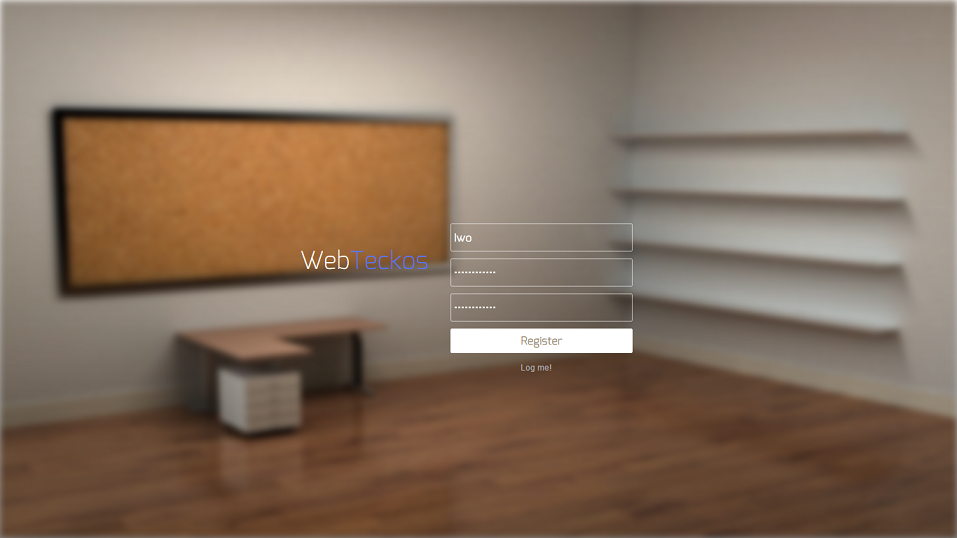
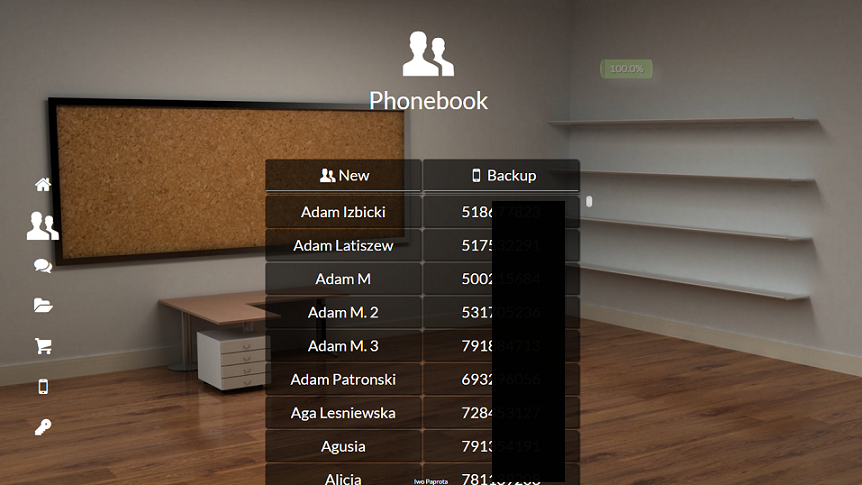
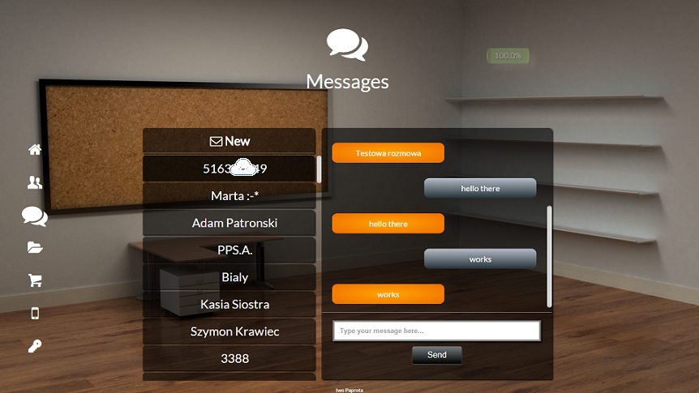
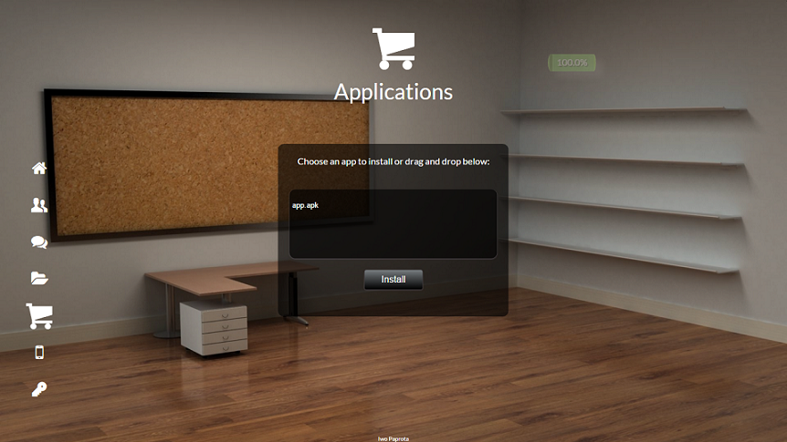
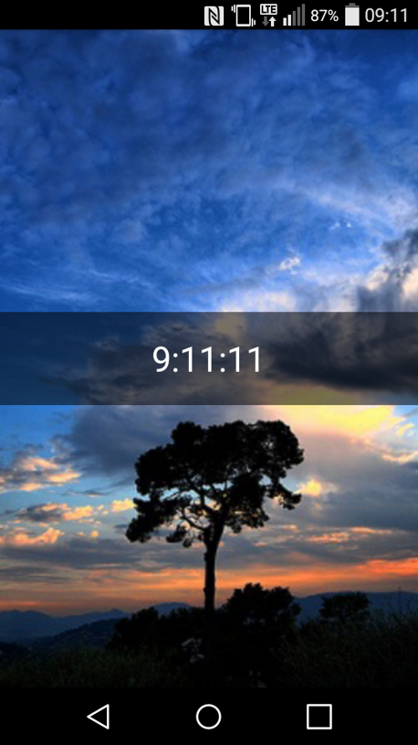

# WebTeckos

The project’s aim is to make an application that supports communication between devices
equipped with Android and workstations equipped with Linux and Microsoft Windows.

The application provides an opportunity to comfortably send user’s media
files and documents between devices. The software provides such functionalities
as making backup of your contact list or sending a text message. To operate correctly,
it would be necessary to install an application on a mobile device and install the Google
Chrome browser on your computer. The preferred method of communication is based on 
Internet connection. Preparation work included such steps as market analysis,
overview of available solutions and technologies, preparation of project design and construction
a prototype interface, use case diagram and database schema. After gathering
all the necessary information the application was implemented and then required tests
were performed.

The project consists of: 
* Java Server using Websockets,
* Webpage written in HTML, Javascript, JQuery and CSS,
* Authentication backend written in PHP using MySQL database,
* Client application on Android using SQLite and websocket libraries.

